 *"the major hurdle to overcome when trying to convince others that we should strive for Open Science: it is a major pain in the ass and is really expensive, in terms of both the money and amount of time required.* 

.fragment *We need to stop telling people 'You should' and get better at telling people 'Here’s how' "* - Emilio Bruna, UF, editor Biotropica

--- ds:noborder
## What is the open science stack?

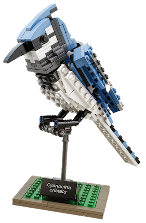

A stack is a complete group of components that work together to produce a goal.

--- ds:noborder
## What is the open science stack?

  
* Open lab notebooks / sharing 
* Open Data
* Open Source / code sharing
* Reproducible writing 
* Open Access / pre-prints
  
  
__Open science stack is all the tools you need to produce open science__

--- ds:noborder
## What is the open science stack?

  
* <strike> Open lab notebooks / sharing </strike> 
* Open Data
* Open Source / code sharing
* <strike> Reproducible writing </strike> 
* <strike> Open Access / pre-prints </strike> 
  
  
__Open science stack is all the tools you need to produce open science__

---

## Open data
 
 
*“Open data and content can be freely used, modified, and shared by anyone for any purpose” - Open Knowledge Foundation*

--- &twocol ds:noborder

## Advantages of open data

Your data can be used long after you're gone

*** =left

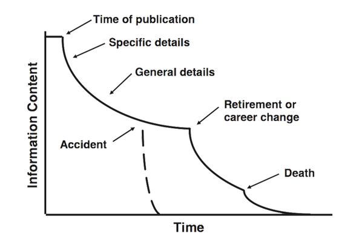

*** =right
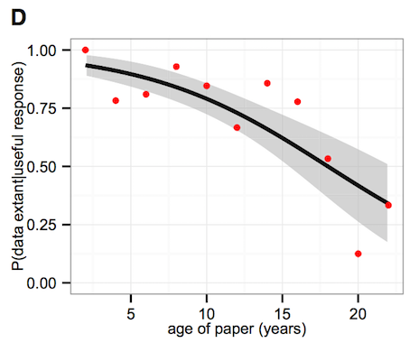

*(Figure 1D - Vines et al 2014)*

--- ds:noborder

## Advantages of open data

Increased citation (9%)

*(Figure 2 - Piowar and Vision 2013)*

--- ds:noborder

## Have a plan for your data

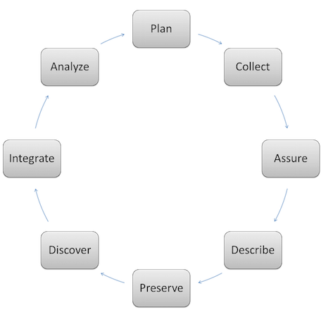

(dataone.org)

http://dmptool.org     

---

## TL;DR rules for sharing open data
  
> 1. Use an open format
> 2. Use a metadata standards
> 3. Use an open license
> 4. Use an open repository

---

## Open data formats
  
**What makes a format open?**
 
> * ASCII based
> * Binary but maintained by an open consortium
> * Machine independent
> * Machine readable (should be)

--- &twocol ds:noborder

## Data format examples

*** =left

**Open**

* FASTA / EMBL / Genbank
* NeXML / NEXUS
* GeoJSON / KML
* CSV
* NetCDF/HDF5

*** =right
**Closed** 

* Excel
* Any proprietary DB
  * Oracle
  * Access
* ESRI shape file

--- ds:noborder

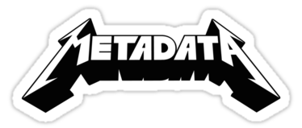
   

> * Know your discipline specific standard
> * Know your funding agency policy
> * Know your journal's policy
> * Know your repository's policy

--- ds:noborder

  
**Some metadata standards**

 
> * *EML* - Ecology
> * *Darwin Core* - Biodiversity data
> * *CF* - Climate data
> * *ISO 19115* - GIS data
> * *MIMS / MIMARK* - Genomic / Metagenomic data

--- ds:noborder

## License please!

  
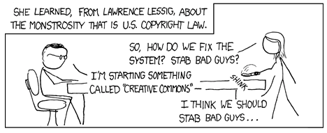

*"To anyone who wants to photocopy, bind, and give a copy of the book to their loved one — more power to them. He/She will likely be disappointed that you’re so cheap, though." - Randall Munroe (xkcd)* 

--- ds:noborder

## License please!
  

Your most open choice, public domain!
 

.fragment Choose a Creative Commons license that fits your comfort level 
 

.fragment No license does not mean your data is open!
 

http://creativecommons.org/choose/

---

## Data repositories
  
**Ideally:**

> * Persistent with fail safes
> * Require metadata
> * Allow versioning
> * Issue a DOI for citability
> * Be open (with an API)!

---
## Data repositories
  
**Some suggestions**
 
* *General purpose* - Figshare / Zenodo 
* *Biodiversity* - GBIF / KNB
* *Nucleic acid sequences* - Genbank / EMBL
  

For more suggestions:

http://www.nature.com/sdata/data-policies/repositories

http://journals.plos.org/plosone/s/data-availability

--- ds:noborder

## Open source / code sharing

  

---

## Advantages of open source
  
> * Facilitates reproducibility 
> * Enables collaboration
> * Incentivises writing clean code (future you thanks you)
> * More people will use what you build

--- 

## Sharing code
  
> * Use version control! (git / <strike>svn</strike>)
> * Write human readable comments
> * Use a license (MIT / GPL / BSD)
> * Share on a public repository (GitHub / Bitbucket)
> * Use an open source platform (e.g. **NOT** matlab, mathematica)
> * Distribute it (CRAN / pipy)
> * Archive releases and assign DOI's
  
http://guides.github.com/activities/citable-code/

--- ds:noborder

## Sharing code and data

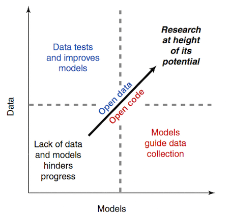
  
Wolkovich et al. 2012

--- ds:noborder

### Open Science, Reproducibility, and Industry

Open standards facilitate government and industry sharing
  
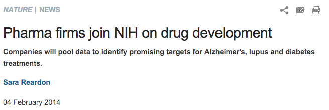

--- ds:noborder

### Open Science, Reproducibility, and Industry

Open standards facilitate government and industry sharing
  
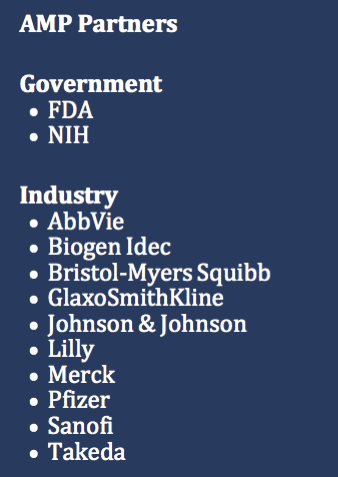

--- ds:noborder

### Open Science, Reproducibility, and Industry

Open standards facilitate government and industry sharing
  
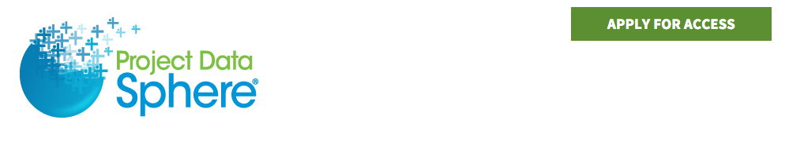

 Relies on Clinical Data Interchange Standards Consortium (CDISC) Study Data Tabulation Model (SDTM) format 

--- ds:noborder

### Open Science, Reproducibility, and Industry

Sharing happens between companies
  
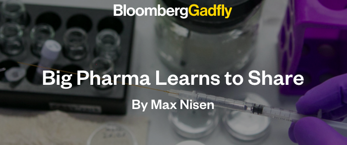

 Sharing between AstraZeneca and Sanofi 

--- ds:noborder

### Open Science, Reproducibility, and Industry

Sharing happens between companies
  
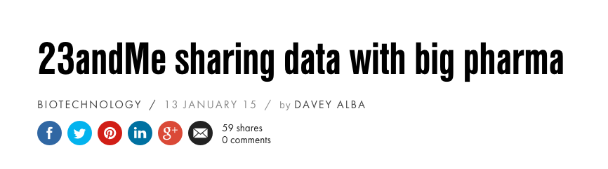

 Sharing between 23AndMe and Pfizer and 23AndMe and Genentech

--- ds:noborder

### Open Science, Reproducibility, and Industry

  
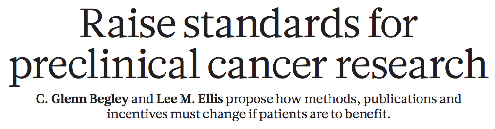

 "Although the issue of irreproducible data has been discussed between scientists for decades, it has recently received greater attention as the costs of drug development have increased along with the number of late-stage clinical-trial failures and the demand for more effective therapies." (doi:10.1038/483531a)

--- ds:noborder

### Open Science, Reproducibility, and Industry

Data science project workflow

  
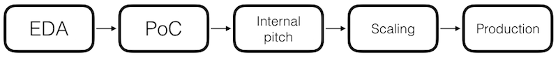

---

*"It is possible to achieve some measure of traditional success while being open. Grants; publications; tenure. 'nuff said."* - C. Titus Brown, UC Davis
  
http://bit.ly/ossohsu
 
@emhrt_

---

